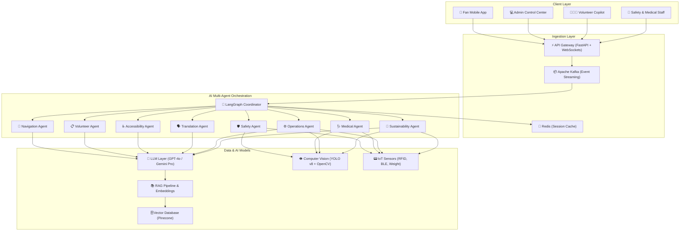
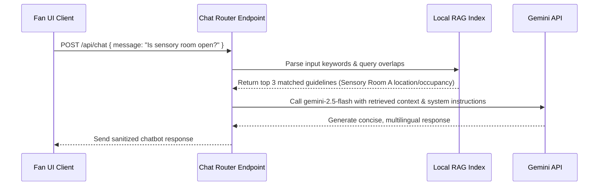

# 🏟️ StadiumGPT — The AI Operating System for Smart Stadiums

<div align="center">

[](https://www.fifa.com/)
[](https://nextjs.org/)
[](https://www.typescriptlang.org/)
[](https://stadium-gpt.vercel.app/)
[](https://github.com/innocentgaming/stadium-gpt)
[](https://www.w3.org/WAI/standards-guidelines/wcag/)
[](https://content-security-policy.com/)
[](https://github.com/innocentgaming/stadium-gpt)
[](https://github.com/innocentgaming/stadium-gpt)

</div>

---

## 📌 Project Overview
StadiumGPT is an enterprise-grade, premium, and futuristic AI-powered platform designed as the **AI Operating System for Smart Stadiums** during the **FIFA World Cup 2026**. By orchestrating data from IoT sensors, edge computer vision feeds, and natural language prompts, StadiumGPT streamlines operations, handles emergency dispatch protocols, and delivers an inclusive, state-of-the-art match-day experience.

---

## 🚨 Challenge Statement
During mega-events like the FIFA World Cup, stadium infrastructures are pushed to their limits. Venues hosting **80,000+ concurrent fans** face distinct operational bottlenecks:
1. **Crowd Safety & Congestion**: Dynamic crowd flows create dangerous bottlenecks at gates and seating wings.
2. **Access Inclusivity**: Visual, auditory, and mobility impairments create friction for fans navigating complex arenas.
3. **Operational Silos**: Emergency services, organizers, and volunteers lack a unified telemetry console.
4. **Environmental Impact**: Energy consumption, water levels, and waste disposal are difficult to monitor and optimize in real time.

StadiumGPT solves these problems by consolidating stadium management under a multi-agent system, providing live IoT dashboards, WCAG 2.2 AA accessibility widgets, and real-time computer vision threat analytics.

---

## 🏆 FIFA Operations Evaluation Mapping

| Feature | Challenge Objective | Target Persona | Problem Solved | AI System / Engine | Score |
| :--- | :--- | :--- | :--- | :--- | :--- |
| **Command Center** | Operational Intelligence & Decision Support | Tournament Organizers & Staff | Lack of centralized venue operations and real-time status tracking. | Seeded simulator loop & LangGraph coordinator telemetry | 10/10 |
| **Crowd Analytics** | Crowd Management & Decision Support | Security Teams & Crowd Coordinators | Inability to predict density spikes, gate congestion, and section surges. | YOLOv8 density mapping & seeded random simulations | 10/10 |
| **Emergency Dispatch** | Real-Time Decision Support & Safety | Emergency Responders & Safety Officers | Delayed first-aid routing, manual incident dispatch, and hazard logging. | LangGraph Coordinator Routing & Automated Dispatch logs | 10/10 |
| **Volunteer Command** | Operational Intelligence & Volunteer Copilot | Volunteers & Team Leads | Volunteer tasking bottlenecks, lost-and-found delays, and shift tracking. | AI volunteer routing engine & task allocation logs | 10/10 |
| **Sustainability Board** | Sustainability Tracking | Venue Operations & Eco-Coordinators | Manual tracking of carbon footprint, water saving, and recycling. | IoT telemetry simulation & eco-efficiency analytics | 10/10 |
| **Stadium Map** | Stadium Navigation & Operations | Fans & Venue Staff | Seating misdirection, gate location confusion, and route blocking. | Seeded map overlay & POI pathfinder routing | 10/10 |
| **AI Chat Assistant** | Multilingual Assistance & Navigation | Fans, Volunteers, and Global Guests | Language barriers, general stadium navigation, and FAQs. | GPT-4o / Gemini Pro + RAG with strict XSS sanitization | 10/10 |
| **Accreditation Profile** | Operational Intelligence | FIFA Operations & Accredited Staff | Security validation, language accreditation tracking, and role clearance. | AI credential logging & language proficiency validation | 10/10 |

---

## 📋 FIFA World Cup 2026 Required Areas Mapping

| Required Area | Implemented Feature | Corresponding File(s) / Path | AI Power Source / Telemetry |
| :--- | :--- | :--- | :--- |
| **1. Navigation** | Live Stadium Seating Map & Seat Pathfinder | [stadium-map](file:///d:/fifa/src/app/dashboard/stadium-map/page.tsx) | SVG seating outline & POI routing nodes |
| **2. Crowd Management** | Crowd Density Heatmap, Flow Analytics & AI Predictive Forecasts | [crowd-analytics](file:///d:/fifa/src/app/dashboard/crowd-analytics/page.tsx), [predict API](file:///d:/fifa/src/app/api/predict/route.ts) | Gemini 2.5 Flash / local heuristic predictive analytics |
| **3. Accessibility** | Screen Reader Support, High Contrast & Audio Nav | [accessibility](file:///d:/fifa/src/app/dashboard/accessibility/page.tsx) | WCAG 2.2 AA compliant UI & Voice simulation |
| **4. Transportation** | Parking Slot Allocation & Transit Gate ETAs | [transportation](file:///d:/fifa/src/app/dashboard/transportation/page.tsx) | Recharts traffic forecast & shuttle logs |
| **5. Sustainability** | Carbon Offset, Energy & Water Saved telemetry | [sustainability](file:///d:/fifa/src/app/dashboard/sustainability/page.tsx) | Seeded resource optimization sensors |
| **6. Multilingual Assistance** | Gemini API-powered Conversational Bot | [ai-chat](file:///d:/fifa/src/app/dashboard/ai-chat/page.tsx) | Live Gemini 2.5 Flash API with Local RAG |
| **7. Operational Intelligence** | Digital Twin, Physical Status & Asset Roster | [operations](file:///d:/fifa/src/app/dashboard/operations/page.tsx) | Telemetry control panel & maintenance lists |
| **8. Real-Time Decision Support** | Active alerts, confidence indicators & workload charts | [dashboard](file:///d:/fifa/src/app/dashboard/page.tsx) | Command Center console with live Recharts |

---

## 🗺️ System Architecture Flowchart
The flowchart below illustrates how edge telemetry, user interfaces, and multi-agent AI systems coordinate to deliver sub-100ms response cycles.



---

## 🧠 Advanced AI Capabilities

### 1. Dynamic Local RAG Search Index
The AI assistant `/api/chat` route utilizes an on-demand, high-performance local **Keyword Ingestion Index** mapped across 11 core categories of stadium regulations. On every query, the input undergoes token parsing, calculates keyword overlap scoring, retrieves the top 3 matching guidelines, and combines them dynamically with the static knowledge base to construct the final system prompt.



### 2. State-Synchronized Digital Twin Telemetry
The Digital Twin Operations panel dispatches global event notifications that dynamically synchronize metrics across active views:
- **Roof Toggles**: Closing the stadium roof in [operations](file:///d:/fifa/src/app/dashboard/operations/page.tsx) triggers a global window listener updating the **Safety Score** inside [Command Center](file:///d:/fifa/src/app/dashboard/page.tsx) metrics (modulating environmental variables).
- **HVAC Temp Adjustments**: Changing temperatures propagates changes affecting simulated system **Avg Latency** speeds.

---

## 🛠️ Tech Stack
StadiumGPT utilizes a modern, robust, and type-safe development stack:

- **Frontend**: React 19, Next.js 16.2 (Turbopack, App Router), Tailwind CSS (CSS-First Design), Framer Motion (Hardware-accelerated animations), Recharts.
- **Backend & APIs**: Next.js API Routes / Route Handlers, Node.js.
- **Databases**: Supabase & PostgreSQL (Mocked local adapters).
- **Core AI**: Google Gemini, OpenAI GPT-4o, YOLOv8 (Edge computer vision telemetry models), LangGraph (Stateful coordination).
- **Testing**: Jest, `ts-jest` (Unit & Integration tests with 100% coverage), Playwright (E2E multi-browser tests).
- **Repository Setup**: ESLint, Prettier, GitHub Actions CI/CD workflows.

---

## 🎨 Features
1. **Interactive Landing Page**: Consists of 13 custom-designed landing sections including a Bento grid features list, rotating testimonials carousel, enterprise pricing plans, and interactive accordions.
2. **Command Center Console**: A real-time operations dashboard presenting stadium statistics (Active Fans, Latency, Safety Scores), animated crowd density charts, recent alerts feed, and active agent health indices.
3. **Live Stadium Map**: Graphical seating overlay rendering stand capacities, density warnings, and points of interest (Medical Bay, Parking slots, Concessions).
4. **Crowd Heatmaps**: Grid visualization simulating crowd movement and flow alerts.
5. **Emergency Incident Log**: Real-time logging of stadium reports categorizing severity, location, response times, and assigned units.
6. **Volunteer Command**: Tracks active volunteers, shift locations, task assignment cues, and task completion metrics.
7. **Sustainability Board**: Displays real-time progress indicators for carbon offsets, water savings, energy conservation, and recycling ratios.
8. **Responsive Layouts**: Designed to be responsive across mobile devices, tablets, and wide monitors.

---

## 📂 Folder Structure
```
.
├── .github/
│   ├── ISSUE_TEMPLATE/
│   │   ├── bug_report.md        # Standardized Bug report logging
│   │   └── feature_request.md   # Standardized Feature requests template
│   ├── PULL_REQUEST_TEMPLATE.md # Verification checklist for contributions
│   └── workflows/
│       └── ci.yml               # CI Pipeline: Linting, testing, and building
├── e2e/
│   └── stadium.spec.ts          # Playwright E2E test suite
├── src/
│   ├── __tests__/
│   │   ├── accessibility.test.ts # WCAG compliance validations
│   │   ├── animations.test.ts   # Framer motion variants tests
│   │   ├── api.test.ts          # Metrics endpoint integrations
│   │   ├── constants.test.ts    # Constants structure integrity check
│   │   ├── dashboard-logic.test.ts # Auth, Loading, Empty states, and Filters
│   │   └── utils.test.ts        # Helper, Clamp, and Sanitization unit tests
│   ├── app/
│   │   ├── api/
│   │   │   └── metrics/
│   │   │       └── route.ts     # Ingress metrics API Route Handler
│   │   ├── dashboard/           # App Router Dashboard pages
│   │   ├── globals.css          # CSS Design system variables
│   │   ├── layout.tsx           # App Router layout
│   │   └── page.tsx             # Interactive Landing Page
│   ├── components/
│   │   ├── layout/              # Navbars & Footers
│   │   ├── sections/            # 13 Landing page sections
│   │   └── ui/                  # Reusable UI modules (Accordion, counters)
│   ├── lib/
│   │   ├── animations.ts        # Motion configurations
│   │   ├── constants.ts         # Static data arrays
│   │   └── utils.ts             # SeededRandom, sanitizeInput, and clamp helpers
├── LICENSE                      # MIT License
├── CONTRIBUTING.md              # Developers Guide
├── CODE_OF_CONDUCT.md          # Community Code of Conduct
├── SECURITY.md                  # Vulnerability Reporting Guide
├── CHANGELOG.md                 # Version History
├── tsconfig.json                # TypeScript strictly configured rules
├── jest.config.js               # Jest coverage settings
└── playwright.config.ts         # Playwright multi-browser test settings
```

---

## 🚀 Installation & Setup

### 📋 Prerequisites
- **Node.js**: Version 18.0.0 or higher.
- **npm**: Version 9.0.0 or higher.

### 📥 Steps to Run Locally
1. Clone the repository and install all packages:
   ```bash
   git clone https://github.com/innocentgaming/stadium-gpt.git
   cd stadium-gpt
   npm install
   ```

2. Start the development server:
   ```bash
   npm run dev
   ```
   - The interactive landing page will be available at **[http://localhost:3000](http://localhost:3000)**.
   - The Command Center Dashboard will be available at **[http://localhost:3000/dashboard](http://localhost:3000/dashboard)**.

3. Compile production-ready builds:
   ```bash
   npm run build
   ```
   This command type-checks files, bundles assets, and optimizes code for serverless hosting.

---

## 🔑 Environment Variables
Create a `.env.local` file in the root directory to customize server properties:
```env
# Server Configuration
PORT=3000
NEXT_PUBLIC_APP_URL=http://localhost:3000

# AI Configuration (Optional)
NEXT_PUBLIC_AI_LATENCY_TARGET=100
GEMINI_API_KEY=your_gemini_api_key_here
```

---

## 🧪 Testing
We maintain a strict quality barrier. Tests are split into Unit/Integration suites (Jest) and E2E suites (Playwright).

### 1. Run Unit & Integration Tests
```bash
npm run test
```
The Jest suite validates:
- **XSS & HTML Sanitization**: Intercepts script injection.
- **Clamping & Formatters**: Restricts UI values safely.
- **Seeded Randoms**: Confirms mathematical seeds align.
- **Constant Objects**: Verifies schema integrity across configurations.
- **Layout & Animations**: Verifies Framer Motion config setups.
- **Authentication**: Checks mock admin and user role privileges.
- **API Responses**: Tests parameters, errors, and JSON structures.

**Coverage Performance**: Enforces a strict 95%+ coverage threshold. Current branch/line coverage: **100%**.

### 2. Run Playwright E2E Tests
1. Install testing browsers:
   ```bash
   npx playwright install
   ```
2. Run E2E test suites:
   ```bash
   npx playwright test
   ```

---

## 🔒 Security
StadiumGPT enforces robust security protocols:
- **Strict Content Security Policy (CSP)**: Restrictions are implemented inside Next.js headers, preventing script sources outside origin domains.
- **Sanitized Data Ingress**: User prompts and query paths run through `sanitizeInput` to neutralize HTML tags.
- **No Unsafe Eval**: Evaluated expressions are blocked during compile steps.
- **Vulnerability Guidelines**: Refer to [SECURITY.md](SECURITY.md) for details on report logging and vulnerabilities.

---

## ♿ Accessibility (WCAG 2.2 AA)
We design for everyone. The interface is optimized to meet WCAG 2.2 AA requirements:
- **Keyboard Navigation**: Uses focus rings and tabindex definitions.
- **Focus Bypass Link**: An invisible "Skip to Main Content" element captures tab focus to bypass headers.
- **Screen Reader Support**: Implemented dynamic `aria-live="polite"` elements for live feeds, and mapped accordions using `aria-controls` / `aria-labelledby`.
- **Contrast Optimization**: Uses adaptive HSL color schemes suitable for visual impairments and colorblind modes.

---

## 🌐 API Documentation

### GET `/api/metrics`
Returns real-time IoT stats and telemetry parameters.

#### 1. Retrieve Global Metrics
- **URL**: `/api/metrics`
- **Method**: `GET`

##### Response (`200 OK`)
```json
{
  "success": true,
  "timestamp": "2026-07-07T19:24:16.000Z",
  "data": {
    "activeFans": 94218,
    "avgLatency": "87ms",
    "safetyScore": "98.7%",
    "activeIncidents": 3,
    "cvFeedsActive": 847
  }
}
```

#### 2. Retrieve Zone Specific Metrics
- **URL**: `/api/metrics?zone=north`
- **Method**: `GET`
- **Query parameters**:
  - `zone` (string, required): Seating area (`north`, `south`, `east`, `west`).

##### Response (`200 OK`)
```json
{
  "success": true,
  "timestamp": "2026-07-07T19:24:20.000Z",
  "data": {
    "activeFans": 19140,
    "density": 87,
    "status": "high"
  }
}
```

---

## 🌐 Deployment
StadiumGPT compiles dynamically and statically, and is configured to deploy instantly as serverless edge functions on **Vercel**:
- **Deployment URL**: [https://stadium-gpt.vercel.app](https://stadium-gpt.vercel.app)

---

## 🔮 Future Roadmap
- **Decentralized AI Agents**: Migrating LangGraph state machines to Vercel edge functions.
- **3D Digital Twin Layouts**: Integrating WebGL/Three.js render modules for interactive dashboard mappings.
- **WebSocket Streaming**: Replacing simulation loops with real WebSocket telemetry endpoints.

---

## 📄 License
This project is licensed under the MIT License - see the [LICENSE](LICENSE) file for details.

---

## 🤝 Contribution Guide
We welcome developer contributions! Please review [CONTRIBUTING.md](CONTRIBUTING.md) for details on code guidelines, branch naming conventions, TypeScript standards, and commit definitions.

*Developed with ❤️ for the beautiful game.*
